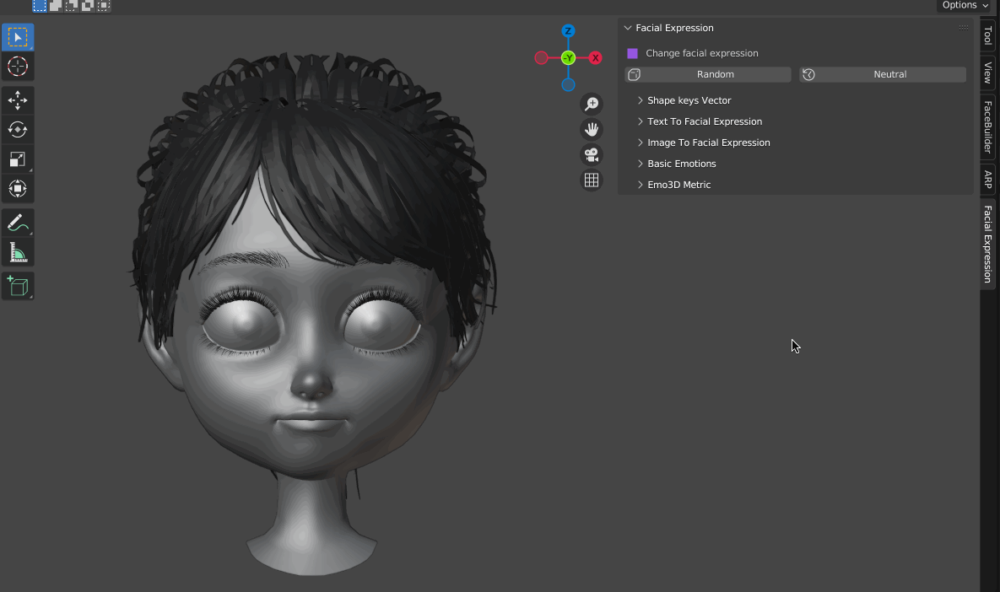
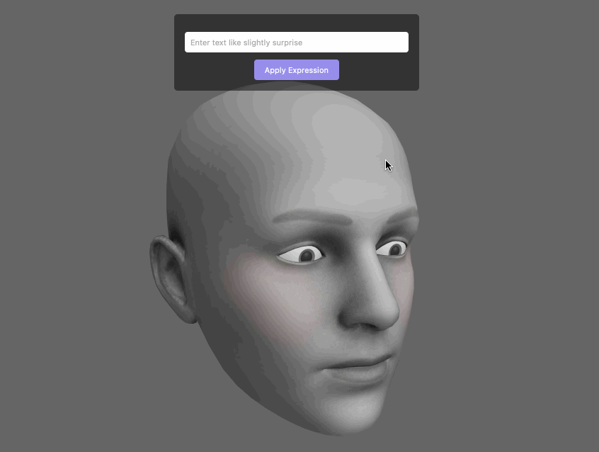

# Emo3D: Metric and Benchmarking Dataset for 3D Facial Expression

[Project Page](https://mahshiddehghani.github.io/Emo3D-page/) | [Paper](https://aclanthology.org/2025.findings-naacl.173/)

## Blender Add-on

**We provide a Blender add-on to visualize and manipulate 3D facial expressions based on emotion descriptions**.



## Web Demo

**Explore our interactive web-based demo to test the CLIP baseline model.**



## Developed By

**Mahshid Dehghani**
*CLIP Baseline, VAE-CLIP, Metric, Blender add-on, web demo*

**Amirahmad Shafiee**
*Emotion-XLM, Glot500 Baseline*

**Ali Shafiei**
*BERT Baseline*

## Bibtex

If you find this code useful in your research, please cite:

```
@inproceedings{dehghani-etal-2025-emo3d,
    title = "{E}mo3{D}: Metric and Benchmarking Dataset for 3{D} Facial Expression Generation from Emotion Description",
    author = "Dehghani, Mahshid  and
      Shafiee, Amirahmad  and
      Shafiei, Ali  and
      Fallah, Neda  and
      Alizadeh, Farahmand  and
      Gholinejad, Mohammad Mehdi  and
      Behroozi, Hamid  and
      Habibi, Jafar  and
      Asgari, Ehsaneddin",
    editor = "Chiruzzo, Luis  and
      Ritter, Alan  and
      Wang, Lu",
    booktitle = "Findings of the Association for Computational Linguistics: NAACL 2025",
    month = apr,
    year = "2025",
    address = "Albuquerque, New Mexico",
    publisher = "Association for Computational Linguistics",
    url = "https://aclanthology.org/2025.findings-naacl.173/",
    pages = "3158--3172",
    ISBN = "979-8-89176-195-7",
    abstract = "3D facial emotion modeling has important applications in areas such as animation design, virtual reality, and emotional human-computer interaction (HCI). However, existing models are constrained by limited emotion classes and insufficient datasets. To address this, we introduce Emo3D, an extensive {\textquotedblleft}Text-Image-Expression dataset{\textquotedblright} that spans a wide spectrum of human emotions, each paired with images and 3D blendshapes. Leveraging Large Language Models (LLMs), we generate a diverse array of textual descriptions, enabling the capture of a broad range of emotional expressions. Using this unique dataset, we perform a comprehensive evaluation of fine-tuned language-based models and vision-language models, such as Contrastive Language-Image Pretraining (CLIP), for 3D facial expression synthesis. To better assess conveyed emotions, we introduce Emo3D metric, a new evaluation metric that aligns more closely with human perception than traditional Mean Squared Error (MSE). Unlike MSE, which focuses on numerical differences, Emo3D captures emotional nuances in visual-text alignment and semantic richness. Emo3D dataset and metric hold great potential for advancing applications in animation and virtual reality."
}
```
